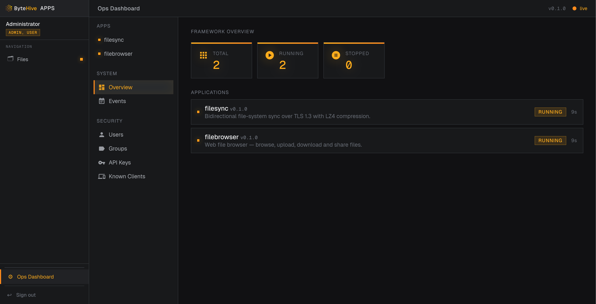
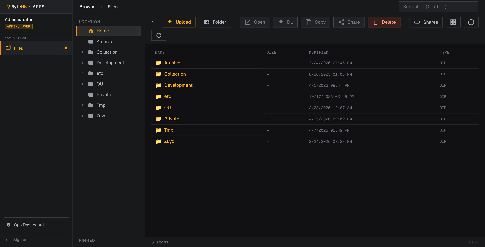
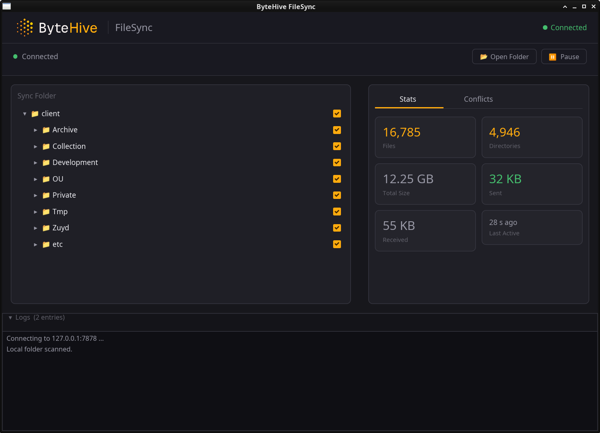
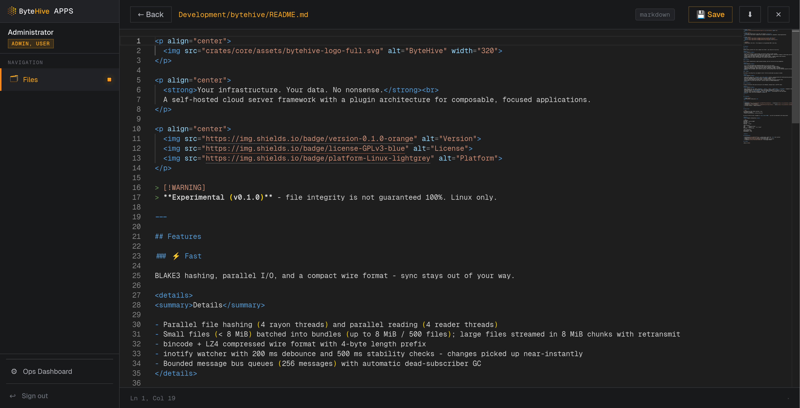

<p align="center">
  
</p>

<p align="center">
  <strong>Your infrastructure. Your data. No nonsense.</strong><br>
  A self-hosted cloud server framework with a plugin architecture for composable, focused applications.
</p>

<p align="center">
  <a href="https://github.com/guydols/ByteHive/actions/workflows/rust.yml">
    
  </a>
  <a href="https://github.com/guydols/ByteHive/actions/workflows/rust.yml">
    
  </a>
  
  
  
</p>

> [!WARNING]
> **Experimental (v0.1.0)** - There can be bugs. Linux only.
> A stress test has ran for 100 hours without a single failure.
> Tests do not yet cover all paths and possibilities.

I started making this out of frustration and hubris. I really wanted a faster file based sync solution. I tried Nextcloud, Owncloud, Opencloud, Seafile, Syncthing, Cozycloud, Pydio Cells and maybe some I forgot. None of these had a the aspects I was looking for. Building proof of concepts and redesigning the architecture several times gave me this.

---

## Features

### ⚡ Fast

BLAKE3 hashing, parallel I/O, and a compact wire format - sync stays out of your way.

<details>
<summary>Details</summary>

- Parallel file hashing (4 rayon threads) and parallel reading (4 reader threads)
- Small files (< 8 MiB) batched into bundles (up to 8 MiB / 500 files); large files streamed in 8 MiB chunks with retransmit
- bincode + LZ4 compressed wire format with 4-byte length prefix
- inotify watcher with 200 ms debounce and 500 ms stability checks - changes picked up near-instantly
- Bounded message bus queues (256 messages) with automatic dead-subscriber GC
</details>

### 🔒 Secure

TLS 1.3 mutual authentication, modern password hashing, and zero trust-on-first-use assumptions.

<details>
<summary>Details</summary>

- TLS 1.3 with AES-256-GCM and ChaCha20-Poly1305 for all file sync traffic
- Mutual TLS using ECDSA P-384 certificates with stable identities persisted to disk
- TOFU server fingerprint pinning; known-clients approval (pending / allowed / rejected)
- Argon2id password hashing, cookie sessions (8 h TTL), named API keys (UUID v4, optional expiry)
- Read-only role enforcement, path traversal prevention, and token-based share links with optional password and expiry
</details>

### ✨ Simple

One binary, one config file, one command to start. First-run wizard gets you going in seconds.

<details>
<summary>Details</summary>

- Single TOML config with `[framework]` and `[apps.<name>]` sections - auto-persisted with format-preserving splicing
- Web assets embedded directly into the binary - nothing to deploy separately
- First-run setup wizard when no users exist - just open a browser
- Built-in web file manager with Monaco editor, file preview, upload/download, and share links
- Bidirectional file sync that just works - conflict copies are created automatically
</details>

### 🧩 Extensible

A plugin architecture that gives each app its own namespace, message topics, and HTTP routes.

<details>
<summary>Details</summary>

- Apps implement the `App` trait (`manifest()`, `start()`, `stop()`, `handle_http()`, `on_message()`) managed by the `AppRegistry`
- Pub/sub message bus with dot-separated topics and wildcard subscriptions (`filesync.*`, `*`)
- SSE event stream at `/api/core/events` - every bus message available to the browser in real time
- Axum HTTP server with proxy routing under `/api/*` and `/apps/*` - each app gets its own route space
- Full user, group, and API key management via admin API
</details>

---

## Screenshots

| | |
|:---:|:---:|
|  |  |
| **Dashboard** | **File Browser** |
|  |  |
| **FileSync Status** | **Monaco Editor** |

---

## Quick Start

### From source
```bash
# Prerequisites: Rust stable toolchain, Linux
cargo build --release
./target/release/bytehive --config config.toml
```
On first run with no users, navigate to `http://<host>:9000/` you will be redirected to the setup wizard.

<details>
<summary>Example configuration</summary>

```toml
[framework]
http_addr  = "0.0.0.0:9000"
http_token = ""
web_root   = ""
log_level  = "info"

[apps.filesync]
root      = "/path/to/folder"
mode      = "server"          # or "client"
bind_addr = "0.0.0.0:7878"

[apps.filebrowser]
max_upload_mb = 200
allow_delete  = true
```

</details>

### Docker

1. Edit the `docker-compose.yml` and change the path `./change/me/data` to the folder you want to sync
2. Run `docker compose up -d`
3. Navigate to `http://<host>:9000/` and go through the setup wizard
4. Use your own proxy to force https (this is not included in ByteHive core, Filesync has build in encryption)


## Documentation

- [Architecture](docs/ARCHITECTURE.md) - system design, module map, `App` trait contract
- [Usage Guide](docs/USAGE.md) - setup and day-to-day usage
- [FileSync](crates/filesync/README.md) - sync protocol and configuration
- [FileBrowser](crates/filebrowser/README.md) - file manager details

## License

[GPLv3](LICENSE)
