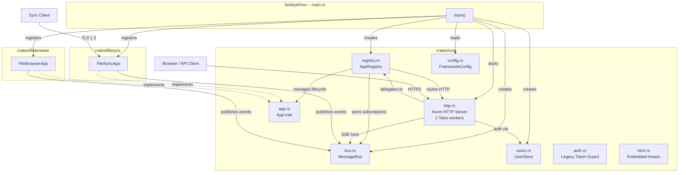
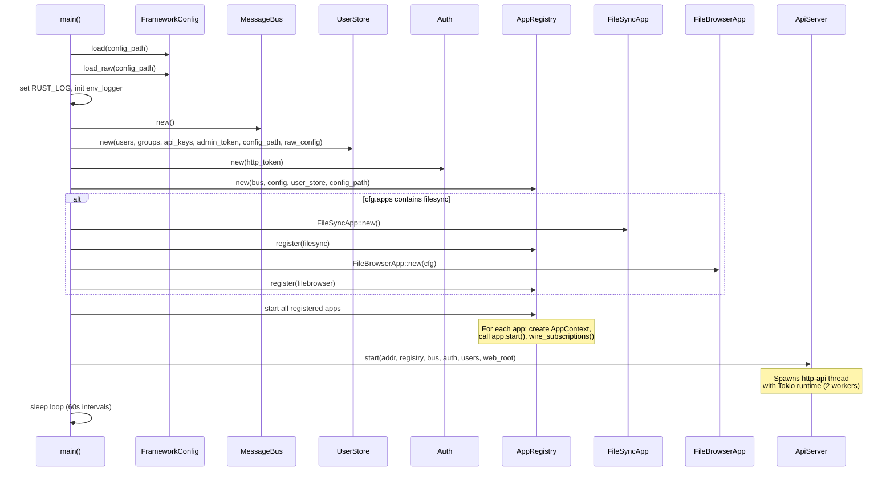
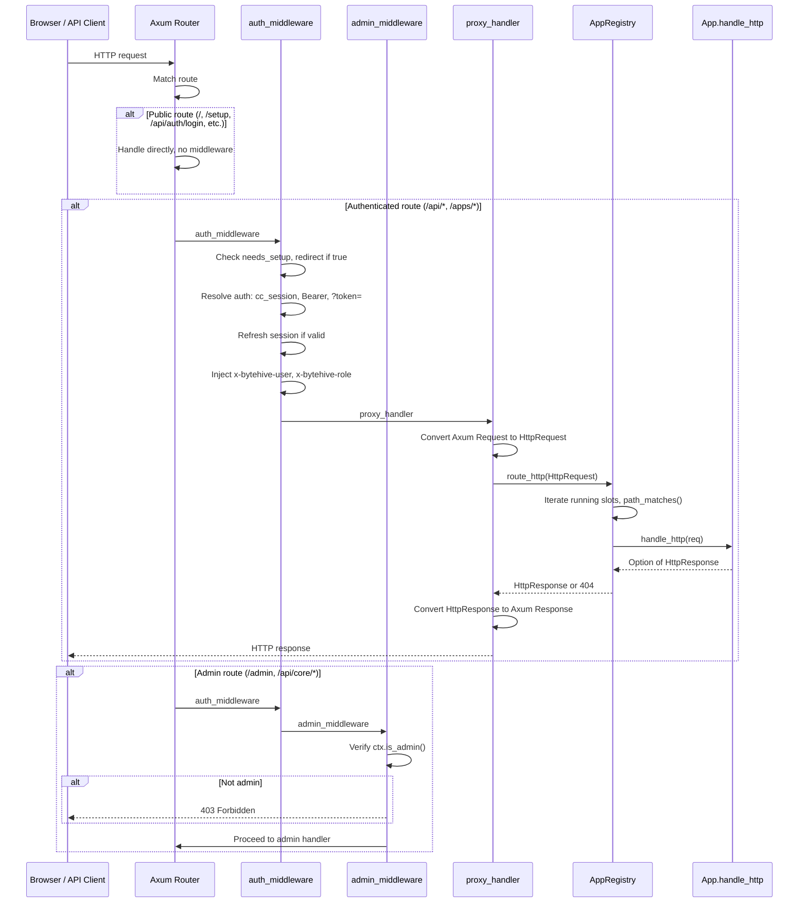
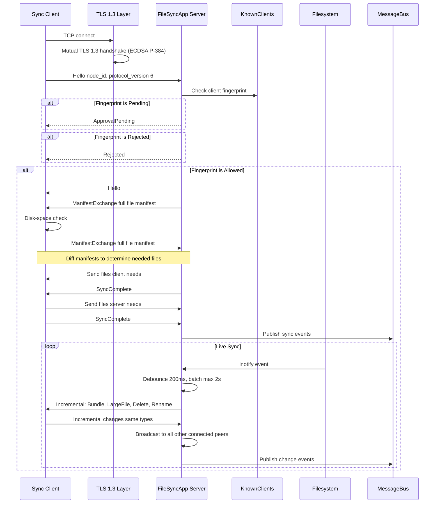
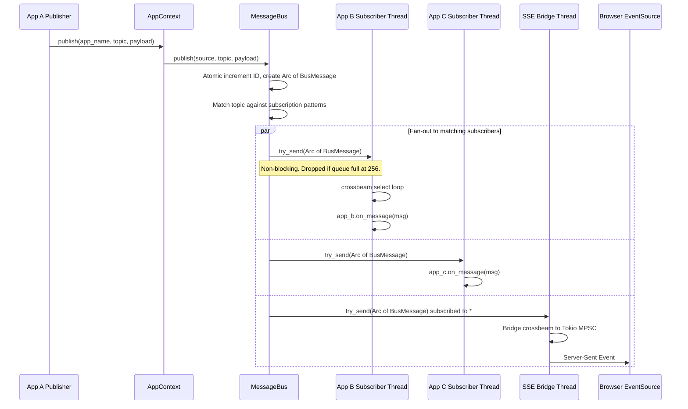

# ByteHive Architecture

> **Comprehensive architecture reference for the ByteHive personal cloud framework.**
> This document describes every module, protocol, data flow, and extension point
> in the system as of the current codebase.

---

## Table of Contents

1. [Overview](#1-overview)
2. [Workspace Layout](#2-workspace-layout)
3. [High-Level Component Diagram](#3-high-level-component-diagram)
4. [Core Modules](#4-core-modules-cratescoresrc)
   - [app.rs -- The Plugin Contract](#41-apprs----the-plugin-contract)
   - [bus.rs -- Message Bus](#42-busrs----message-bus)
   - [registry.rs -- App Lifecycle](#43-registryrs----app-lifecycle)
   - [http.rs -- HTTP Server](#44-httprs----http-server)
   - [config.rs -- Configuration](#45-configrs----configuration)
   - [users.rs -- User Management](#46-usersrs----user-management)
   - [auth.rs -- Legacy Token Guard](#47-authrs----legacy-token-guard)
   - [html.rs -- Embedded Assets](#48-htmlrs----embedded-assets)
   - [error.rs -- CoreError](#49-errorrs----coreerror)
5. [The Main Binary](#5-the-main-binary-binbytehive)
6. [Design Decisions](#6-design-decisions)
7. [Data Flow: Startup Sequence](#7-data-flow-startup-sequence)
8. [Data Flow: HTTP Request](#8-data-flow-http-request)
9. [Data Flow: Sync Protocol](#9-data-flow-sync-protocol)
10. [Data Flow: Message Bus](#10-data-flow-message-bus)
11. [Complete HTTP Route Map](#11-complete-http-route-map)
12. [Access Model](#12-access-model)
13. [Adding a New App](#13-adding-a-new-app)

---

## 1. Overview

ByteHive is a self-hosted, single-binary personal cloud framework. It provides a
plugin architecture (the **App** trait) with a built-in message bus, HTTP API
server, authentication system, and two bundled applications:

| App | Purpose |
|-----|---------|
| **FileSyncApp** (`crates/filesync`) | Bidirectional file synchronisation over TLS 1.3 |
| **FileBrowserApp** (`crates/filebrowser`) | Web-based file manager |

All web assets (HTML, CSS, SVG) are embedded into the binary via `include_str!`,
enabling zero-dependency deployment as a single executable.

---

## 2. Workspace Layout

```text
bytehive/
|-- crates/
|   |-- core/                  # Framework: App trait, bus, registry, HTTP server, auth
|   |   |-- assets/            # 9 files: HTML templates, CSS, SVG brand assets
|   |   |-- src/               # 10 source files
|   |   +-- tests/
|   |-- filesync/              # Bidirectional file sync over TLS 1.3
|   |   |-- src/               # 13 source files + bin/ and gui/ subdirs
|   |   +-- tests/
|   +-- filebrowser/           # Web-based file manager
|       |-- src/               # 9 source files
|       +-- tests/
|-- bin/
|   +-- bytehive/              # Main binary -- wires everything together
|       +-- src/main.rs
|-- config.toml                # Single config file for framework + all apps
+-- docs/
    +-- ARCHITECTURE.md        # This file
```

- **`crates/core`** -- The framework itself. Every other crate depends on it.
- **`crates/filesync`** -- The sync engine: TLS transport, manifest diffing, inotify watcher, TOFU trust.
- **`crates/filebrowser`** -- Web file manager: browse, upload, download, share links.
- **`bin/bytehive`** -- Thin binary that loads config, creates the registry, registers apps, and starts the HTTP server.

---

## 3. High-Level Component Diagram



---

## 4. Core Modules (`crates/core/src/`)

### 4.1 `app.rs` -- The Plugin Contract

The `App` trait is the central abstraction. Every application in ByteHive
implements it. The trait is object-safe (`Send + Sync + 'static`) so apps are
stored as `Arc<dyn App>`.

```rust
pub trait App: Send + Sync + 'static {
    fn manifest(&self) -> AppManifest;           // Required -- static metadata
    fn start(&self, ctx: AppContext) -> Result<(), CoreError>; // Required -- spawn threads, return quickly
    fn stop(&self);                              // Required -- join threads, flush state

    fn handle_http(&self, req: &HttpRequest) -> Option<HttpResponse>; // Default: None
    fn on_message(&self, msg: &Arc<BusMessage>);                      // Default: no-op
}
```

#### `AppManifest`

Derives `Debug, Clone`. Returned by `manifest()` to declare an app's identity
and routing/UI metadata.

| Field | Type | Purpose |
|-------|------|---------|
| `name` | `&'static str` | Unique app identifier |
| `version` | `&'static str` | Semantic version |
| `description` | `&'static str` | Human-readable summary |
| `http_prefix` | `Option<&'static str>` | API route prefix (e.g. `/api/filesync`) |
| `ui_prefix` | `Option<&'static str>` | UI route prefix (e.g. `/apps/filesync`) |
| `nav_label` | `&'static str` | Navigation bar label |
| `nav_icon` | `&'static str` | Navigation bar icon |
| `show_in_nav` | `bool` | Whether to show in the navigation bar |
| `subscriptions` | `&'static [&'static str]` | Bus topic patterns the app subscribes to |
| `publishes` | `&'static [&'static str]` | Bus topics the app publishes (documentation only) |

#### `AppContext`

Cloneable context injected into `start()`. Fields:

| Field | Type | Purpose |
|-------|------|---------|
| `bus` | `Arc<MessageBus>` | Shared message bus |
| `config` | `AppConfig` | App-specific config from `[apps.<name>]` |
| `shutdown` | `Receiver<()>` (crossbeam) | Shutdown signal |
| `auth_service` | `Arc<UserStore>` | Credential validation |
| `config_path` | `PathBuf` | Path to `config.toml` |

Key methods:

- `config_dir()` -- Directory containing `config.toml`
- `publish(app_name, topic, payload)` -- Convenience wrapper around `bus.publish()`
- `authenticate(credential) -> Option<AuthContext>` -- Validate a credential via `UserStore`

---

### 4.2 `bus.rs` -- Message Bus

The message bus is ByteHive's inter-app communication backbone. Apps never call
each other directly; they publish JSON events to named topics and subscribe to
topic patterns.

#### Constants

- `BUS_QUEUE_DEPTH = 256` -- Default bounded channel capacity per subscriber.

#### `BusMessage`

| Field | Type | Source |
|-------|------|--------|
| `id` | `u64` | Atomic counter, starts at 1 |
| `source` | `String` | Publishing app name |
| `topic` | `String` | Dotted topic name |
| `payload` | `serde_json::Value` | Arbitrary JSON |
| `timestamp_ms` | `u64` | Milliseconds since UNIX epoch |

#### `BusReceiver`

Wraps a crossbeam `Receiver<Arc<BusMessage>>`. Uses an `Arc`/`Weak` sentinel
pattern for liveness detection -- the bus holds a `Weak` reference and can detect
when a subscriber has been dropped.

Implements `Deref` to the inner `Receiver`.

#### `MessageBus` Methods

| Method | Behaviour |
|--------|-----------|
| `new()` | Create an empty bus |
| `subscribe(pattern, queue)` | Subscribe with explicit queue depth |
| `sub(pattern)` | Subscribe with `BUS_QUEUE_DEPTH` |
| `publish(source, topic, payload)` | Create `BusMessage`, fan out to matching subscribers |
| `patterns()` | List all active subscription patterns |
| `gc()` | Remove dead subscribers (dropped `Weak` references) |

#### Topic Matching Rules

| Pattern | Matches |
|---------|---------|
| `"*"` | Every topic |
| `"filesync.transfer"` | Exact match only |
| `"filesync.*"` | `"filesync.anything"` **and** `"filesync"` itself |

#### Publish Semantics

- **Non-blocking** -- Uses `try_send`. If a subscriber's queue is full (256), the
  message is **dropped for that subscriber only** and a warning is logged.
- **Fan-out** -- Every matching subscriber receives an `Arc` clone of the same message.

#### Dead Subscriber Cleanup

`gc()` checks each subscriber's `Weak` reference. If the strong count has
dropped to zero, the subscription is removed.

---

### 4.3 `registry.rs` -- App Lifecycle

The `AppRegistry` owns all registered apps and manages their lifecycle.

#### `AppStatus` Enum

Serialized as lowercase strings: `running`, `stopped`, `failed`.

#### `AppInfo`

Full runtime information exposed via the admin API:

| Field | Type |
|-------|------|
| `name` | `String` |
| `version` | `String` |
| `description` | `String` |
| `http_prefix` | `Option<String>` |
| `ui_prefix` | `Option<String>` |
| `status` | `AppStatus` |
| `status_detail` | `Option<String>` |
| `config_toml` | `String` |
| `uptime_secs` | `Option<u64>` |

#### `Slot` (Private)

Internal bookkeeping per registered app:

| Field | Type |
|-------|------|
| `app` | `Arc<dyn App>` |
| `manifest` | `AppManifest` |
| `stop_tx` | Shutdown sender |
| `config` | `AppConfig` |
| `status` | `AppStatus` |
| `status_detail` | `Option<String>` |
| `started_at` | `Option<Instant>` |

#### `AppRegistry`

Fields: `slots` (`RwLock<Vec<Slot>>`), `bus`, `config`, `user_store`, `config_path`.

| Method | Behaviour |
|--------|-----------|
| `register(app)` | Add app to registry (dedup check by name) |
| `start_app(name)` | Create `AppContext`, call `app.start()`, wire subscriptions |
| `stop_app(name)` | Send shutdown signal, call `app.stop()` |
| `restart_app(name)` | Stop, 300 ms pause, then start |
| `update_config(name, toml)` | Update app's config in registry |
| `all_app_infos()` | Snapshot of all apps as `Vec<AppInfo>` |
| `app_info(name)` | Single app info |
| `get(name)` | Raw `Arc<dyn App>` lookup |
| `manifests()` | All manifests |
| `route_http(req)` | Route request to matching app |
| `stop_all()` | Stop all apps in **reverse** registration order |

#### Subscription Wiring (`wire_subscriptions`)

For each pattern in `manifest.subscriptions`:

1. Create a bus subscription via `bus.subscribe(pattern, BUS_QUEUE_DEPTH)`
2. Spawn a named thread `"{name}-sub-{pattern}"`
3. Thread runs a `crossbeam::select!` loop, dispatching to `app.on_message()`
   until the shutdown channel fires

#### HTTP Routing (`route_http`)

1. Iterate all running slots
2. Check if request path matches `http_prefix` or `ui_prefix` via `path_matches()`
3. Delegate to `app.handle_http(req)`
4. Return first `Some(HttpResponse)`, or `HttpResponse::not_found()` as fallback

#### Path Matching (`path_matches`)

Returns `true` if the request path starts with the prefix **and** the remainder
is empty, starts with `/`, or starts with `?`.

---

### 4.4 `http.rs` -- HTTP Server

Built on **Axum**. The HTTP server is the only async component in the system.

#### `ApiServer`

| Field | Type |
|-------|------|
| `addr` | `String` |
| `registry` | `Arc<AppRegistry>` |
| `bus` | `Arc<MessageBus>` |
| `auth` | `Arc<Auth>` |
| `users` | `Arc<UserStore>` |
| `web_root` | `String` |

- Spawns a thread named `"http-api"` containing a Tokio multi-thread runtime
  with **2 worker threads**.
- CORS: allow **any** origin, method, and headers.
- Request body limit: **512 MiB**.
- Cookie name: `cc_session` (HttpOnly, SameSite=Lax).

#### `HttpRequest`

| Field | Type |
|-------|------|
| `method` | `String` |
| `path` | `String` |
| `query` | `String` |
| `headers` | `HashMap<String, String>` |
| `body` | `Vec<u8>` |
| `auth` | `Option<AuthContext>` |

Method: `json<T>()` -- Deserialise body as JSON.

#### `HttpResponse`

| Field | Type |
|-------|------|
| `status` | `u16` |
| `content_type` | `String` |
| `headers` | `HashMap<String, String>` |
| `body` | `Vec<u8>` |

Factory methods:

| Method | Status |
|--------|--------|
| `ok_json(value)` | 200, pretty-printed JSON |
| `ok_html(html)` | 200 |
| `ok_text(text)` | 200 |
| `not_found()` | 404 |
| `unauthorized()` | 401 |
| `forbidden()` | 403 |
| `bad_request(msg)` | 400 |
| `internal_error(msg)` | 500 |

Builder: `with_header(key, val)` -- Add a response header.

#### Middleware

**`auth_middleware`**

1. Check if setup is needed (redirect to `/setup` if no users exist)
2. Resolve auth in priority order: `cc_session` cookie, then `Bearer` token, then `?token=` query parameter
3. Refresh session if valid
4. Inject headers: `x-bytehive-user`, `x-bytehive-role`
5. Proceed to handler
6. For `/apps/*` routes: unauthenticated requests get a `302` redirect (not `401`)

**`admin_middleware`**

1. Same setup check as `auth_middleware`
2. Requires `ctx.is_admin()` -- returns `403 Forbidden` for non-admin users

#### SSE (`/api/core/events`)

1. Subscribes to `"*"` on the message bus
2. Bridges crossbeam to Tokio MPSC via a `"sse-bridge"` thread
3. Streams `BusMessage` events to the browser via `EventSource`

#### `proxy_handler`

Converts an Axum `Request` into an `HttpRequest`, calls `registry.route_http()`,
and converts the resulting `HttpResponse` back into an Axum `Response`.

#### `share_handler`

Dispatches `/s/:token` requests to `/api/filebrowser/s/{token}` via the registry
**without authentication** (public share links).

---

### 4.5 `config.rs` -- Configuration

#### `FrameworkConfig`

| Section | Fields |
|---------|--------|
| `[framework]` | `http_addr` (default `"0.0.0.0:9000"`), `http_token` (default `""`), `web_root` (default `""`), `log_level` (default `"info"`) |
| `[[users]]` | `username`, `password_hash`, `display_name` |
| `[[groups]]` | `name`, `description`, `members` (Vec of String) |
| `[[api_keys]]` | `name`, `key`, `as_user`, `expires_ms` (Option), `created_at` |
| `[apps.<name>]` | Arbitrary per-app TOML (passed as `AppConfig`) |

Methods:

| Method | Purpose |
|--------|---------|
| `load(path)` | Parse config file |
| `load_raw(path)` | Load as raw TOML string |
| `app_config(name)` | Extract `[apps.<name>]` section as `AppConfig` |

#### `AppConfig`

Wraps a `toml::Value`. Methods:

| Method | Purpose |
|--------|---------|
| `empty()` | Create empty config |
| `get<T>(key)` | Type-safe value lookup |
| `raw()` | Access underlying `toml::Value` |

---

### 4.6 `users.rs` -- User Management

#### Built-in Groups

| Constant | Value | Protected |
|----------|-------|-----------|
| `GROUP_ADMIN` | `"admin"` | Cannot be deleted |
| `GROUP_USER` | `"user"` | Cannot be deleted |

#### Core Types

**`UserEntry`**: `username`, `password_hash`, `display_name`

**`Group`**: `name`, `description`, `members` (Vec of String)

**`ApiKey`**: `name`, `key`, `as_user`, `expires_ms` (Option), `created_at`
- `is_expired()` -- Check expiry against current time
- `effective_username()` -- Returns `as_user` if set, otherwise `"api-{name}"`

**`AuthMethod`** enum: `Session`, `ApiKey { key_name }`, `AdminToken`, `DevMode`

**`AuthContext`**: `username`, `display_name`, `groups`, `method`
- `is_admin()` -- User is in `"admin"` group
- `can_write()` -- User is in `"admin"` or `"user"` group
- `in_group(name)` -- Group membership check
- `dev_admin()` -- Create an admin context for dev mode
- `admin_token()` -- Create an admin context for token auth

**`Session`**: `token`, `username`, `display_name`, `expires_ms`
- `ttl_secs()` -- Remaining time-to-live

#### `UserStore`

Central auth service. Fields:

| Field | Type | Notes |
|-------|------|-------|
| `users` | `RwLock<Vec<UserEntry>>` | |
| `groups` | `RwLock<Vec<Group>>` | |
| `api_keys` | `RwLock<Vec<ApiKey>>` | |
| `sessions` | `RwLock<HashMap<String, Session>>` | In-memory session store |
| `admin_token` | `String` | Public field |
| `session_ttl_ms` | `u64` | 8 hours (28,800,000 ms) |
| `config_path` | `Option<PathBuf>` | |
| `raw_config` | `RwLock<String>` | Raw TOML for splicing |

Key methods:

| Method | Behaviour |
|--------|-----------|
| `needs_setup()` | True if no users exist |
| `complete_setup(password)` | Min 8 chars; creates admin user with hashed password |
| `hash_password(pw)` | Argon2 with `OsRng` |
| `verify_password(pw, hash)` | Argon2 verify; **rejects legacy SHA-256 hashes** |
| `login(username, password)` | Verify credentials, create session |
| `validate(token)` | Validate session token |
| `refresh(token)` | Extend session expiry |
| `logout(token)` | Remove session |
| `authenticate_credential(cred)` | Priority: session, then API key, then admin token (all constant-time) |
| `persist()` | Splice auth sections into raw config and write to disk |
| `gc()` | Remove expired sessions |

#### Config Persistence (`splice_auth_sections`)

A line-by-line parser that replaces `[[users]]`, `[[groups]]`, and `[[api_keys]]`
sections in the raw config TOML while preserving all other content (framework
settings, app configs, comments between sections).

---

### 4.7 `auth.rs` -- Legacy Token Guard

Simple bearer-token authentication for the framework HTTP endpoint.

| Method | Behaviour |
|--------|-----------|
| `new()` | Create with token string |
| `check(headers)` | Extract and verify `Authorization: Bearer <token>` |
| `verify_token(provided)` | **Constant-time** XOR comparison to prevent timing attacks |

**Special case:** An empty token means no authentication is required.

---

### 4.8 `html.rs` -- Embedded Assets

All web assets are compiled into the binary via `include_str!`:

| Constant | Source | Purpose |
|----------|--------|---------|
| `SETUP_HTML` | `assets/setup.html` | Initial setup page |
| `PORTAL_HTML` | `assets/portal.html` | Login / portal page |
| `ADMIN_DASHBOARD_HTML` | `assets/admin.html` | Admin dashboard |
| `FILEBROWSER_HTML` | `assets/filebrowser.html` | File browser UI |
| `SHARE_ERROR` | `assets/share_error.html` | Share link error page |
| `PASSWORD_SHARE` | `assets/password_share.html` | Password-protected share prompt |
| `FLAT_KIT_CSS` | `assets/flatkit.css` | UI stylesheet |
| `DODECAHEDRON_SVG` | inline (40x40) | ByteHive icon |
| `PASSWORD_SHARE_ERROR` | inline | Password share error content |

---

### 4.9 `error.rs` -- CoreError

```rust
enum CoreError {
    Io(std::io::Error),
    Config(String),
    AppAlreadyRegistered(String),
    AppNotFound(String),
    BusClosed,
    Http(String),
    App(String),
}
```

- Implements `Display` and `std::error::Error`
- Implements `From<io::Error>` for ergonomic `?` usage

---

## 5. The Main Binary (`bin/bytehive`)

**File:** `bin/bytehive/src/main.rs`

**CLI:** Single flag `-c` / `--config` (default: `"config.toml"`).
About string: `"ByteHive personal cloud framework"`.

### Startup Sequence

1. Parse CLI args
2. Load `FrameworkConfig` + raw TOML string
3. Set `RUST_LOG` environment variable from `framework.log_level`, init `env_logger`
4. Create `MessageBus`
5. Create `UserStore` (populated with users, groups, api_keys, admin_token, config_path, raw_config)
6. Create `Auth` (with `http_token`)
7. Create `AppRegistry`
8. **Conditional app registration** -- only if `cfg.apps` contains `"filesync"`:
   - Register `FileSyncApp::new()`
   - Register `FileBrowserApp::new(cfg)` -- receives framework config to resolve filesync root
9. Start `ApiServer` (on `http_addr`)
10. Main thread sleeps in a **60-second loop** (keeps process alive)

---

## 6. Design Decisions

### 1. Threads over Async

All app code uses `std::thread` + `crossbeam_channel`. The Axum/Tokio runtime is
isolated inside `http.rs` with exactly **2 worker threads**. Apps never touch
async code, which keeps the plugin API simple and avoids coloured-function
problems.

### 2. One Config File

A single `config.toml` contains `[framework]` settings plus `[apps.<name>]`
sections for each app. Auth sections (`[[users]]`, `[[groups]]`, `[[api_keys]]`)
are auto-spliced on writes, preserving all other content.

### 3. Bus-First IPC

Apps communicate exclusively through the message bus by publishing JSON events to
named topics and subscribing to topic patterns. Apps **never call each other
directly**, ensuring loose coupling and allowing new apps to observe events
without modifying existing code.

### 4. Object-Safe App Trait

The `App` trait uses only concrete types in its methods (no generics), allowing
apps to be stored as `Arc<dyn App>` and managed uniformly by the registry.

### 5. TLS 1.3 Only for Filesync

The sync protocol uses TLS 1.3 exclusively with:
- Cipher suites: **AES-256-GCM** + **ChaCha20-Poly1305**
- Mutual TLS with persisted **ECDSA P-384** certificates
- No fallback to older TLS versions

### 6. TOFU Trust Model

Trust-On-First-Use: the client pins the server's certificate fingerprint on first
connection. The server maintains a known-clients store with three states:
**pending**, **allowed**, **rejected**. New clients require explicit approval.

### 7. Config Auto-Persistence

Both `UserStore` and `KnownClients` splice their changes into `config.toml`
using a line-by-line parser that preserves sections belonging to other components.
This means auth changes, client approvals, and similar state mutations are
automatically saved without overwriting unrelated config.

### 8. Embedded Web Assets

HTML, CSS, and SVG files are compiled into the binary via `include_str!`. This
enables zero-dependency deployment -- the entire application is a single
executable with no external file dependencies.

### 9. Graceful Shutdown

A crossbeam shutdown channel is created per app and propagated via
`AppContext.shutdown`. Worker threads monitor this receiver and exit cleanly.
`stop_all()` shuts down apps in **reverse** registration order.

---

## 7. Data Flow: Startup Sequence



---

## 8. Data Flow: HTTP Request



---

## 9. Data Flow: Sync Protocol



---

## 10. Data Flow: Message Bus



---

## 11. Complete HTTP Route Map

### Public Routes (no authentication)

| Route | Method | Handler | Description |
|-------|--------|---------|-------------|
| `/` | GET | `portal_handler` | Login page; redirects to `/setup` if no users exist |
| `/setup` | GET | `setup_page_handler` | Initial setup page |
| `/api/auth/login` | POST | `login_handler` | Body: `{ username, password }` |
| `/api/auth/setup` | POST | `setup_api_handler` | Body: `{ password }` |
| `/web/*path` | GET | `static_handler` | Static files from `web_root` directory |
| `/s/:token` | GET, POST | `share_handler` | Public share links (delegates to filebrowser, no auth) |
| `/bytehive-icon.svg` | GET | -- | Inline SVG icon |
| `/bytehive-logo-full.svg` | GET | -- | Inline SVG logo |

### Authenticated Routes

| Route | Method | Handler | Description |
|-------|--------|---------|-------------|
| `/api/auth/me` | GET | `me_handler` | Current user info |
| `/api/auth/logout` | POST | `logout_handler` | End session |
| `/api/*` | ANY | `proxy_handler` | Routes to app via `registry.route_http()` |
| `/apps/*` | ANY | `proxy_handler` | Routes to app UI via `registry.route_http()` |

### Admin Routes (admin group required)

| Route | Method | Handler | Description |
|-------|--------|---------|-------------|
| `/admin` | GET | `admin_handler` | Admin dashboard HTML |
| `/api/core/status` | GET | `core_status_handler` | System status |
| `/api/core/apps` | GET | `list_apps_handler` | List all registered apps |
| `/api/core/apps/:name` | GET | `app_info_handler` | Single app info |
| `/api/core/apps/:name/config` | PUT | `update_config_handler` | Update app config |
| `/api/core/apps/:name/start` | POST | `start_app_handler` | Start an app |
| `/api/core/apps/:name/stop` | POST | `stop_app_handler` | Stop an app |
| `/api/core/apps/:name/restart` | POST | `restart_app_handler` | Restart an app (300 ms pause) |
| `/api/core/events` | GET | `events_handler` | SSE event stream |
| `/api/core/users` | GET | `list_users_handler` | List all users |
| `/api/core/users` | POST | `create_user_handler` | Create a user |
| `/api/core/users/:username` | PUT | `update_user_handler` | Update a user |
| `/api/core/users/:username` | DELETE | `delete_user_handler` | Delete a user |
| `/api/core/groups` | GET | `list_groups_handler` | List all groups |
| `/api/core/groups` | POST | `create_group_handler` | Create a group |
| `/api/core/groups/:name` | DELETE | `delete_group_handler` | Delete a group |
| `/api/core/groups/:name/members/:username` | POST | `add_member_handler` | Add user to group |
| `/api/core/groups/:name/members/:username` | DELETE | `remove_member_handler` | Remove user from group |
| `/api/core/apikeys` | GET | `list_apikeys_handler` | List all API keys |
| `/api/core/apikeys` | POST | `create_apikey_handler` | Create an API key |
| `/api/core/apikeys/:name` | DELETE | `revoke_apikey_handler` | Revoke an API key |
| `/api/core/config/export` | GET | `export_config_handler` | Export full config |

---

## 12. Access Model

| Group | Permissions |
|-------|-------------|
| **admin** | Full access: all APIs, ops dashboard, user/group/key management |
| **user** | Read/write access to app APIs (`can_write()` returns `true`) |
| **any other** | App-defined semantics; `can_write()` returns `false` |

- `admin` and `user` are **built-in groups** and cannot be deleted.
- Auth resolution priority: **session cookie** then **Bearer token** then **`?token=` query parameter**.
- All credential comparisons use **constant-time** operations.
- Password hashing uses **Argon2** with `OsRng`; legacy SHA-256 hashes are explicitly rejected.
- Sessions have an **8-hour TTL** (28,800,000 ms) and are refreshed on each valid request.

---

## 13. Adding a New App

### Step-by-Step

1. **Create the crate** under `crates/myapp/` with a `Cargo.toml` depending on `bytehive-core` and a `src/lib.rs`.

2. **Implement the `App` trait:**
   - `manifest()` -- Return an `AppManifest` with a unique name, version, prefixes, etc.
   - `start(ctx)` -- Spawn worker threads using `std::thread`. Store `JoinHandle`s. Return quickly.
   - `stop()` -- Signal threads to stop (via `ctx.shutdown`), join all handles, flush state.
   - `handle_http(req)` -- (Optional) Handle HTTP requests matching your `http_prefix`/`ui_prefix`.
   - `on_message(msg)` -- (Optional) React to bus messages matching your `subscriptions`.

3. **Add to workspace:** Add `"crates/myapp"` to the `[workspace.members]` array in the root `Cargo.toml`.

4. **Add dependency:** Add `bytehive-myapp` to `bin/bytehive/Cargo.toml`.

5. **Register in main:** In `bin/bytehive/src/main.rs`, call `registry.register(MyApp::new())`.

6. **Add config section:** Add `[apps.myapp]` to `config.toml` with any app-specific settings.

7. **Use the `AppContext`:**
   - `ctx.shutdown` -- Monitor this `Receiver<()>` in worker threads to detect stop signals.
   - `ctx.bus` -- Publish events and subscribe to topics for inter-app communication.
   - `ctx.config` -- Read typed configuration via `config.get::<T>(key)`.
   - `ctx.auth_service` -- Validate credentials via `ctx.authenticate(credential)`.

### Guidelines

- **Never use async** in your app code. Use `std::thread` + `crossbeam_channel`.
- **Return from `start()` quickly** -- spawn threads, do not block.
- **Publish events** for anything other apps might care about.
- **Use `ctx.shutdown`** in all thread loops to enable graceful shutdown.
- **Prefix HTTP paths** -- Use `http_prefix` for API routes and `ui_prefix` for UI routes to avoid collisions.

---

*This document is generated from the ByteHive codebase. Update it when the architecture changes.*
