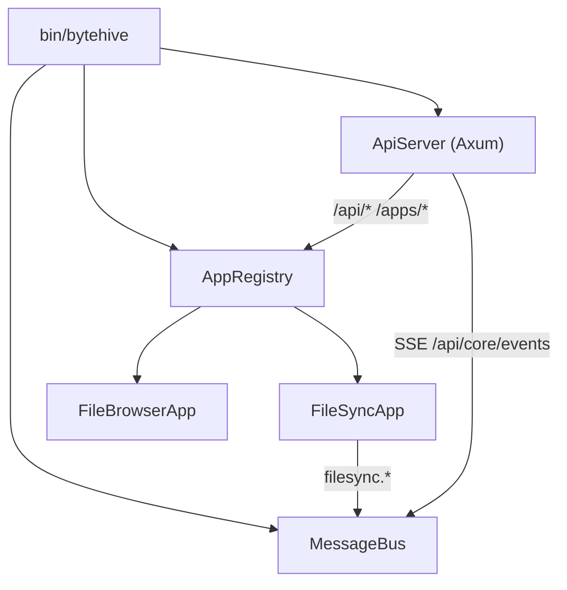

# Architecture

## Workspace layout

```
bytehive/
├── crates/
│   ├── core/         # Framework: App trait, bus, registry, HTTP server
│   ├── filesync/     # Bidirectional file sync over TLS 1.3
│   └── filebrowser/  # Web-based file browser
├── bin/
│   └── bytehive/    # Main binary — wires everything together
└── config.toml
```

## Component diagram



## Core modules (`crates/core`)

| Module | Responsibility |
|--------|---------------|
| `app.rs` | `App` trait, `AppContext`, `AppManifest` |
| `bus.rs` | `MessageBus` — pub/sub with wildcard topics |
| `registry.rs` | `AppRegistry` — lifecycle, bus wiring, HTTP routing |
| `http.rs` | `ApiServer` — Axum HTTP server + embedded dashboard |
| `config.rs` | `FrameworkConfig` + per-app `AppConfig` TOML slices |
| `auth.rs` | Static bearer token gate (legacy; prefer `UserStore`) |
| `users.rs` | `UserStore` — users, groups, API keys, sessions |
| `html.rs` | Compiled-in HTML/CSS assets (`include_str!`) |

## Design decisions

**Threads over async.** All app code uses `std::thread` + `crossbeam_channel`. The HTTP
layer uses Axum/Tokio but is isolated inside `http.rs`; apps never touch async.

**One config file.** `[framework]` holds framework settings; each app gets `[apps.<n>]`
as a typed TOML slice. Auth sections are spliced back on every write to preserve
formatting in the rest of the file.

**Bus-first inter-app communication.** Apps publish JSON events and subscribe to topic
patterns. They never call each other directly.

**Object-safe `App` trait.** All methods use concrete types, so apps are stored as
`Arc<dyn App>` with no extra boxing.

**TLS 1.3 only for filesync.** Cipher suites: AES-256-GCM and ChaCha20-Poly1305.
Server uses a self-signed ECDSA P-384 cert generated in memory on each startup. Clients
skip cert verification; access control is via `Hello.credential`.

## The `App` trait

```rust
pub trait App: Send + Sync + 'static {
    fn manifest(&self) -> AppManifest;
    fn start(&self, ctx: AppContext) -> Result<(), CoreError>;  // spawn threads, return quickly
    fn stop(&self);                                              // join threads, flush state

    fn handle_http(&self, req: &HttpRequest) -> Option<HttpResponse> { None }
    fn on_message(&self, msg: &Arc<BusMessage>) {}
}
```

`AppContext` fields:

| Field | Type | Purpose |
|-------|------|---------|
| `bus` | `Arc<MessageBus>` | Publish/subscribe |
| `config` | `AppConfig` | App-specific TOML slice |
| `shutdown` | `Receiver<()>` | Fires once on stop/restart — poll in worker threads |
| `auth_service` | `Arc<UserStore>` | Validate non-HTTP credentials |

To validate a credential from a non-HTTP channel:
```rust
match ctx.authenticate(&token_from_client) {
    Some(auth) if auth.can_write() => { /* proceed */ }
    Some(_)  => { /* read-only */ }
    None     => { /* reject */ }
}
```

## Message bus

Topics are dot-separated. Wildcard subscriptions:
- `"filesync.*"` — all sub-topics under `filesync`
- `"*"` — everything

Publishing never blocks. A full subscriber queue drops the message for that subscriber
only (logged as a warning); other subscribers are unaffected.

## HTTP route map

### Public (no auth)
| Route | Description |
|-------|-------------|
| `GET /` | Portal login shell |
| `POST /api/auth/login` | Create session |
| `POST /api/auth/logout` | Destroy session |
| `GET /web/*path` | Static assets |
| `GET /s/:token` | Public share link |
| `POST /s/:token` | Password-protected share access |

### Authenticated
| Route | Description |
|-------|-------------|
| `GET /api/auth/me` | Current identity |
| `GET /api/core/status` | Framework version + registered apps |
| `GET/PUT/POST /api/core/apps[/:name[/action]]` | App lifecycle |
| `GET /api/core/events` | SSE event stream |
| `ANY /api/*` | Routed to app matching `http_prefix` |
| `ANY /apps/*` | Routed to app matching `ui_prefix` |

### Admin only
| Route | Description |
|-------|-------------|
| `GET /admin` | Ops dashboard |
| `/api/core/users[/:username]` | User CRUD |
| `/api/core/groups[/:name[/members/:username]]` | Group CRUD |
| `/api/core/apikeys[/:name]` | API key CRUD |
| `GET /api/core/config/export` | Config export |

## Access model

| Group | Access |
|-------|--------|
| `admin` | Full access, ops dashboard, all management APIs |
| `user` | Read/write access to app APIs |
| any other | App-defined semantics; `can_write()` returns false |

`admin` and `user` are built-in groups that cannot be deleted.

## Adding a new app

1. Create `crates/myapp/` with a `Cargo.toml` and `src/{lib,app}.rs`.
2. Implement `App` in `app.rs`.
3. Add to workspace `Cargo.toml` members.
4. Add dependency to `bin/bytehive/Cargo.toml`.
5. Register in `bin/bytehive/src/main.rs`.
6. Add `[apps.myapp]` config section.
